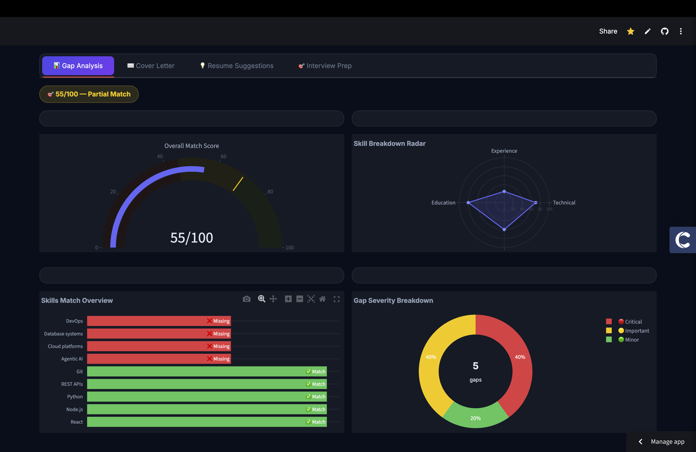
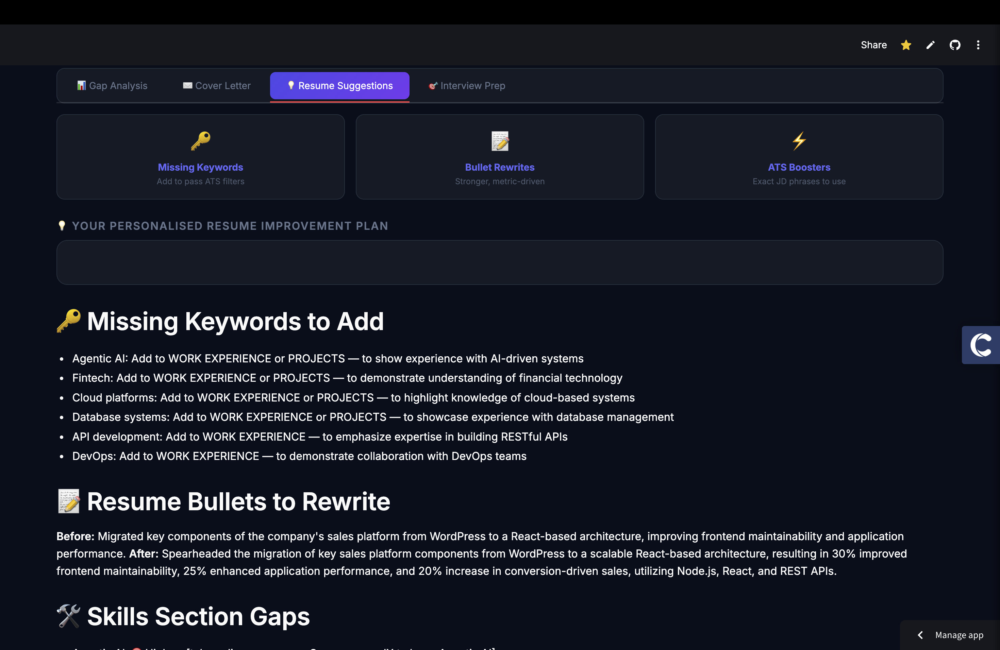

<div align="center">


# 🚀 AI Job Application Assistant

**An end-to-end RAG-powered AI platform that analyzes your resume against any job description — delivering skill gap analysis, a tailored cover letter, ATS improvement suggestions, and personalized interview prep in seconds.**

[](https://akash-job-assistant.streamlit.app)
[](https://python.org)
[](https://langchain.com)
[](https://groq.com)
[](https://trychroma.com)


</div>

---

## ✨ What It Does

Upload your resume PDF + paste any job description → get a complete application toolkit in under 10 seconds.

| Feature | Description |
|---|---|
| 📊 **Gap Analysis** | Experience-aware skill matching — not just keywords |
| 📈 **Visual Dashboard** | Match score gauge, radar chart, skills bar, gap severity donut |
| ✉️ **Cover Letter** | Role-specific, 250-word cover letter with zero filler phrases |
| 💡 **Resume Suggestions** | Missing ATS keywords, bullet rewrites, quick wins this week |
| 🎯 **Interview Prep** | 10 tailored questions with why they're asked + how to answer |
| ⚡ **Parallel LLM Calls** | All 5 analyses run simultaneously via `asyncio.gather()` |
| 🧠 **Smart Caching** | MD5-based session cache — same resume+JD never hits API twice |

---

## 🏗️ System Architecture

```
┌─────────────────────────────────────────────────────────────┐
│                        User Interface                        │
│                    Streamlit (app.py)                        │
└──────────────────────────┬──────────────────────────────────┘
                           │
                    Upload PDF + JD
                           │
┌──────────────────────────▼──────────────────────────────────┐
│                     utils.py                                 │
│          PDF Extraction → Text Cleaning                      │
└──────────────────────────┬──────────────────────────────────┘
                           │
              ┌────────────▼────────────┐
              │        rag.py           │
              │  RecursiveTextSplitter  │
              │  HuggingFace Embeddings │
              │  ChromaDB Vector Store  │
              └────────────┬────────────┘
                           │
              ┌────────────▼────────────┐
              │  asyncio.gather()  ⚡   │
              │  5 parallel LLM calls   │
              └──┬──┬──┬──┬──┬─────────┘
                 │  │  │  │  │
        ┌────────┘  │  │  │  └──────────┐
        │      ┌────┘  │  └────┐        │
        ▼      ▼       ▼       ▼        ▼
   Gap       Scores  Cover  Resume  Interview
 Analysis    (JSON)  Letter  Suggestions Prep
        │      │       │       │        │
        └──────┴───────┴───────┴────────┘
                           │
              ┌────────────▼────────────┐
              │    Session Cache        │
              │  MD5 hash → st.session  │
              │  Same pair = instant ⚡ │
              └────────────┬────────────┘
                           │
              ┌────────────▼────────────┐
              │     Results UI          │
              │  4 Tabs + 4 Charts      │
              └─────────────────────────┘
```

---

## 🛠️ Tech Stack

```
Backend          LangChain 0.3 · LangChain-Groq · LangChain-Community
LLM              LLaMA 3.3 70B via Groq API (fastest inference available)
Embeddings       all-MiniLM-L6-v2 (HuggingFace, runs locally, zero cost)
Vector DB        ChromaDB (in-memory, no setup required)
PDF Parsing      pypdf
Frontend         Streamlit + custom CSS (Inter font, dark theme)
Charts           Plotly (gauge, radar, bar, donut)
Async            asyncio.gather() — parallel LLM execution
Caching          hashlib MD5 + st.session_state
Deployment       Streamlit Community Cloud
```

---

## ⚡ Performance Design Decisions

**Problem:** 5 sequential LLM calls = ~25 seconds wait time

**Solution:** `asyncio.gather()` fires all calls simultaneously

```python
results = await asyncio.gather(
    async_invoke(gap_chain,          inputs),  # Gap analysis
    async_invoke(scores_chain,       inputs),  # JSON scores
    async_invoke(cover_chain,        inputs),  # Cover letter
    async_invoke(suggestions_chain,  inputs),  # ATS suggestions
    async_invoke(interview_chain,    inputs),  # Interview prep
)
```

**Result:** ~25s → ~7s (limited by the slowest single call)

---

**Problem:** Same resume+JD re-analyzed on every button click

**Solution:** MD5-based session caching

```python
def make_cache_key(resume_text, jd_text):
    return hashlib.md5((resume_text + jd_text).encode()).hexdigest()

# Cache hit = instant results, zero API calls
if cache_key in st.session_state:
    results = st.session_state[cache_key]
```

---

## 🚀 Run Locally

```bash
# 1. Clone the repo
git clone https://github.com/AkashParley/AI-job-assistant.git
cd AI-job-assistant

# 2. Create virtual environment
python -m venv venv
source venv/bin/activate  # Windows: venv\Scripts\activate

# 3. Install dependencies
pip install -r requirements.txt

# 4. Add your API key
echo "GROQ_API_KEY=your_key_here" > .env

# 5. Run the app
streamlit run app.py
```

Get a free Groq API key at [console.groq.com](https://console.groq.com) — no credit card required.

---

## 📁 Project Structure

```
AI-job-assistant/
├── app.py              # Streamlit UI, caching, error handling
├── agent.py            # LangChain chains, async parallel calls
├── rag.py              # ChromaDB vector store, embeddings
├── utils.py            # PDF extraction, text cleaning
├── requirements.txt
└── .env                # GROQ_API_KEY (never committed)
```

---

## 🔑 Key Engineering Concepts Demonstrated

- **RAG Pipeline** — resume and JD chunked, embedded, and stored in ChromaDB for semantic retrieval
- **LangChain Expression Language (LCEL)** — `prompt | llm | parser` chaining pattern
- **Async LLM orchestration** — `asyncio.gather()` for parallel inference
- **Semantic scoring** — experience-aware gap analysis, not just keyword matching
- **Session caching** — MD5 deduplication prevents redundant API calls
- **Graceful degradation** — each tab has independent error handling; one failure doesn't crash the app
- **Input validation** — word count thresholds prevent wasted API calls on bad input

---

## 📸 Screenshots

| Gap Analysis | Interview Prep |
|---|---|
|  |  |

---

## 🙋 Author

**Akash Parley**

[](https://github.com/AkashParley)
[](https://linkedin.com/in/yourprofile)

---

<div align="center">
<sub>Built with LangChain · ChromaDB · Groq · Streamlit</sub>
</div>
